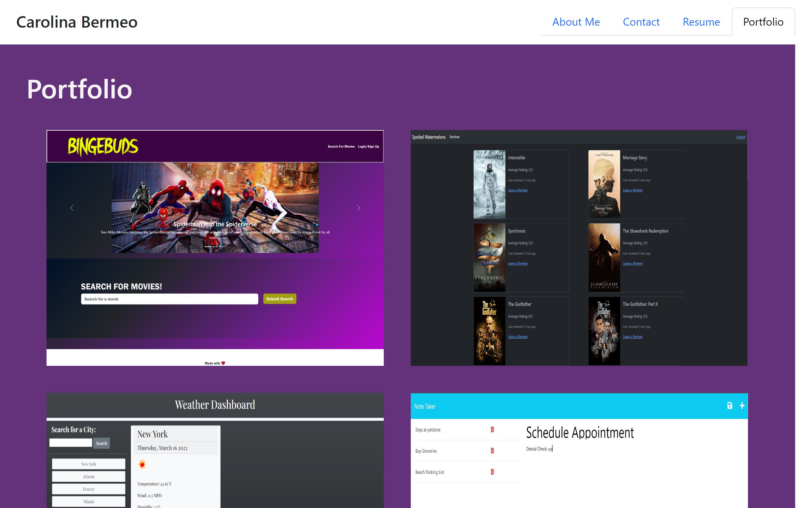

# React Portfolio

    
## Table of Contents
* [Description](#description)
* [Built-With](#built-with)
* [Demo](#demo)
* [Installation](#installation)
* [License](#license)
* [Contributing](#contributing)
* [Tests](#tests)
* [Questions](#questions)

## Description
    
This is a React application that showcases an About Me, Contact Form, and Resume section, as well as a Portfolio section with projects that I have completed throughout the UNC Bootcamp Full-Stack Developing course. 

## Built-With

This project was bootstrapped with [Create React App](https://github.com/facebook/create-react-app).

  
  
  
  
  
  
  
  
  

## Demo

The following images display the web application's appearance and functionality:

## Installation

There is no installation required for this website. The webpage can be found by clicking the link below:

[Caro-React-Portfolio](https://carolinapalacios95.github.io/Caro-React-Portfolio)

## License
        
    MIT

## Contributing

Not currently accepting contributions to this project.

## Tests

N/A

## Questions

If there are additional questions, please reach out to me here: 

* GitHub: https://github.com/Carolinapalacios95
* Email: carolina.palacios1995@gmail.com